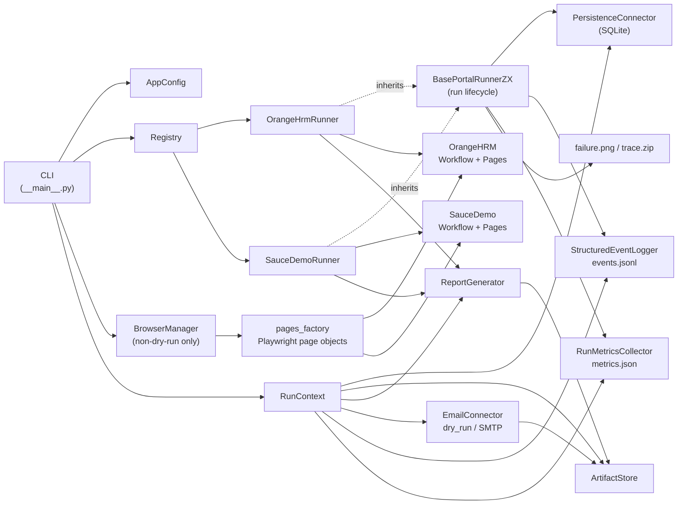

# Design

## Executive Summary

This project implements a production-oriented portal automation platform for the Zentist RPA
Lead take-home assignment. The repository is intentionally small enough to review locally,
but the design separates reusable RPA concerns from portal-specific workflow code so the same
shape can scale to many portals.

The current implementation supports two registered portals:

- `orangehrm`
- `saucedemo`

Shared code owns configuration, secrets boundaries, persistence, artifacts, reports, email,
structured events, metrics, retry policy, stale recovery, Playwright browser lifecycle, and the
base runner lifecycle. Portal packages own only their input schema, page object selectors,
business workflow, and runner hooks.

### Figure ZQ9



Key relationships:

- CLI reads `AppConfig`, queries the registry, and assembles `RunContext`.
- Dry-run validates wiring and inputs without browser creation.
- Non-dry-run creates a Playwright browser/context/page and injects portal page objects through
  `pages_factory`.
- `OrangeHrmRunner` and `SauceDemoRunner` inherit from `BasePortalRunnerZX` and do not override
  the shared `run()` lifecycle.
- `BasePortalRunnerZX.run()` owns run creation, item isolation, idempotent item persistence,
  event/metric emission, failure diagnostics, and final run status.
- Portal runners call portal workflows and finalizers; finalizers write `report.txt` and call
  `EmailConnector.send_report()`.

## Orchestration And Throughput

The shipped CLI runs one portal or `all` sequentially. This is deliberate for the take-home:
reviewers can reproduce a run locally, inspect SQLite rows, and map each row back to code.

For a production target of roughly 100 portals and 30,000 jobs, the same package boundary would
be run behind an external orchestrator or queue. Jobs would be partitioned by portal and by the
portal-specific session constraint. The worker contract remains the same:

1. lease a job or batch for one portal;
2. create one run record;
3. process items with idempotency keys;
4. emit events, metrics, artifacts, and a report;
5. release or retry only according to reason-code taxonomy.

Throughput would scale horizontally by adding workers for portals that allow concurrency. A
portal with a single-login constraint, such as OrangeHRM demo credentials, would be pinned to
one active session. Portals with per-account isolation, such as Sauce Demo, can be sharded by
account as long as each account keeps its own session boundary.

Backpressure belongs in the external queue: each portal gets rate limits, max active sessions,
and retry-delay rules. The worker should stay simple and deterministic.

## Portal Constraints

OrangeHRM:

- Registry key: `orangehrm`.
- Runner class: `OrangeHrmRunner`.
- Operation: `sync_employee_state`.
- Item key: `employee_key`.
- Session constraint: `max_sessions_per_login = 1`.
- Real runs require `ORANGEHRM_PASSWORD` through environment/config secrets boundary.
- The runner logs in once per session before employee work.
- The workflow finds or creates an employee, finds newly created records after add, updates job
  fields idempotently, generates a sanitized salary document, uploads it only when missing, and
  verifies attachment presence.

Sauce Demo:

- Registry key: `saucedemo`.
- Runner class: `SauceDemoRunner`.
- Operation: `checkout`.
- Item key: `account_key`.
- Session constraint: `max_sessions_per_account = 1`.
- Real runs require `SAUCEDEMO_PASSWORD` through environment/config secrets boundary.
- Password-like values are rejected from input data.
- The workflow logs in, adds exactly the requested item count, validates cart and summary
  counts, captures order details, persists those details before `Finish`, finishes checkout,
  and records per-account outcomes.

## Isolation And Failure Handling

Known portal failures are raised as `PortalError` with a `ReasonCode`. The base lifecycle
converts item-level failures into failed `ItemResult` rows and continues the batch. Unexpected
item exceptions become `ReasonCode.UNEXPECTED_ERROR`.

Persistence writes are intentionally close to item processing:

1. `mark_item_in_progress()` records the item before `process_item()`.
2. portal workflow performs browser work and may persist additional safety checkpoints when a
   business step requires durability before a final click;
3. `upsert_item_result()` commits the final outcome.

Sauce Demo uses this safety checkpoint before checkout completion so order details are durable
before pressing `Finish`.

`RetryPolicy` is used by the portal workflow path for retryable browser operations. Retryable
reason codes include `PORTAL_TIMEOUT`, `PORTAL_UNAVAILABLE`, and `SESSION_DROPPED`.
Non-retryable examples include `LOCKED_OUT`, `INPUT_VALIDATION_FAILED`,
`EMPLOYEE_MATCH_AMBIGUOUS`, and credential/login failures. Writes are not blindly retried; the
workflow verifies current state first and uses idempotent checks before writing.

The current `RetryPolicy` executes retries immediately without delay. For production deployments
where a portal enforces rate limits or has transient backend load, a configurable exponential
backoff can be enabled by passing `backoff_seconds` and `backoff_multiplier` to the policy and
injecting a sleep callable. This keeps the default behavior deterministic and test-safe (zero
delay) while allowing production workers to pace retries for rate-limited portals.

On failures in non-dry-run Playwright sessions, the runtime captures reviewer-friendly
diagnostics when available:

- `screenshots/<portal>_<item>_failure.png`;
- `traces/<portal>_<item>_trace.zip`.

Diagnostic failures never replace the original business error.

Timeouts are deterministic but portal-aware. `DEFAULT_TIMEOUT_SECONDS` remains the global
fallback, while `ORANGEHRM_TIMEOUT_SECONDS` and `SAUCEDEMO_TIMEOUT_SECONDS` let slower or
faster portals use different Playwright wait bounds without changing workflow code. This
prevents a slow government-style portal from forcing every fast private portal to wait on an
overly large global timeout. For a 100+ portal production platform, the next evolution would
be per-operation timeout groups such as navigation, DOM interaction, search, and upload
timeouts. True adaptive timeout tuning should be metrics-driven: measure P50/P95/P99 latency
per portal/operation, feed observed latency back into bounded timeout recommendations, and
alert when P95/P99 degrades beyond expected thresholds. That percentile feedback loop belongs
in the observability pipeline; the shipped runtime keeps timeout behavior deterministic.

## Idempotency And Recovery

The architectural idempotency key is:

```text
business_date + portal_name + item_key + operation
```

SQLite enforces it with:

```text
UNIQUE (business_date, portal_name, item_key, operation)
```

`get_committed_items()` returns same-day successful item keys for a portal. The base lifecycle
skips those items on rerun. `list_results_by_business_date()` lets reports include persisted
same-day results, including successful items from earlier runs.

Crash and silent-failure recovery surfaces are:

- `find_stale_items()`;
- `find_stale_runs()`;
- `mark_run_stale()`.

The `recover` CLI command can dry-run or mutate stale unfinished runs/items. It never deletes
completed results.

## Monitoring And Observability

Every run produces local, inspectable surfaces:

- SQLite `runs` and `item_results` rows;
- structured `ReasonCode` values;
- `report.txt`;
- `email_report.txt` for dry-run email backend, or SMTP delivery when configured;
- `events.jsonl` through `StructuredEventLogger`;
- `metrics.json` through `RunMetricsCollector`;
- generated documents and optional failure screenshots/traces.

For production, these local artifacts map directly to external systems: `events.jsonl` to log
aggregation, `metrics.json` counters to a metrics backend, and SQLite to a service database.
The code keeps those boundaries explicit so the take-home remains runnable without external
infrastructure.

For reviewer and CI-style validation, deterministic synthetic input generation is safer than seeding public demo portals: generated data validates the batch pipeline, partial failure isolation, reporting, and metrics without mutating shared external systems. In production, jobs would arrive from a queue, API, or scheduled database query rather than from local JSON files.


## Production Enhancement: Session Reuse

The shipped runtime intentionally creates fresh Playwright contexts by default. That is safer for
review and for multi-account demo flows, but production portals with strict authentication rate
limits can add an opt-in Playwright `storage_state` layer, disabled by default. After a successful login, the worker
would save cookies and localStorage to a gitignored sensitive directory. A later run could create
the context with that state and skip UI login only after a read-only authentication check proves
the session is still valid.

The critical failure mode is silent session expiry: a restored state may redirect to `/login` and
make the next employee or order lookup fail with a misleading page-object error. A production
implementation must therefore verify authentication after restore, clear expired state, and fall
back to a fresh login before any business action. Expired session state must never be classified
as an employee/order not found condition.

Security and isolation rules are strict: storage-state files contain live auth cookies/tokens, so
they belong only under ignored sensitive artifact paths, with a TTL and no contents in logs,
reports, metrics, or sample artifacts. State must be isolated per portal and, for multi-account
flows such as Sauce Demo, per account. A shared Sauce Demo state file would risk leaking
`standard_user` into `visual_user` or another account, so the current implementation deliberately
keeps fresh contexts for the runnable demo and documents session reuse as production hardening.

## Technology Choices

Python package + CLI:

- simple to install and review;
- deterministic in local execution;
- keeps lifecycle, persistence, and workflow tests visible.

Playwright:

- modern browser automation with robust locators, trace viewer, and screenshots;
- a clear separation between fake page tests and opt-in live e2e tests.

Live e2e tests are intentionally limited to read-only smoke tests (login, employee search) to
avoid mutating the shared public demo portal and to keep opt-in test runs stable across concurrent
users.

SQLite:

- durable local state without external services;
- supports idempotency and recovery checks;
- easy for reviewers to inspect.

pytest + ruff:

- fast default verification without live portal dependencies;
- `ruff check`, `ruff format --check`, and `pytest` are CI-friendly.

Rejected options:

- n8n: useful for low-code orchestration, but the assignment needs source-controlled lifecycle,
  tests, idempotency, and recovery semantics.
- UiPath: heavier runtime and less transparent for code review.
- Airflow: good scheduler infrastructure, but it would obscure the core portal automation
  slice in this take-home. A production deployment could place these runners behind Airflow,
  Windmill, or another queue/orchestrator later.

## Operating Model

Credentials rotate through environment variables. Input files contain business data, not
passwords. Reviewers can start with `python -m portal_automation all --dry-run`, then run a
single non-dry-run portal after installing Chromium and setting demo credentials.

When a portal is down or layout behavior changes, failures surface through reason codes,
persisted item rows, generated reports, events, metrics, and Playwright diagnostics. If a
process dies mid-run, stale `in_progress` items and unfinished runs can be recovered through the
CLI.

The repository intentionally excludes a web UI, HTTP API, production scheduler, and deployment
packaging from the runnable slice. Those are design-level concerns around the same worker
contract and are represented by the architecture boundaries above.
