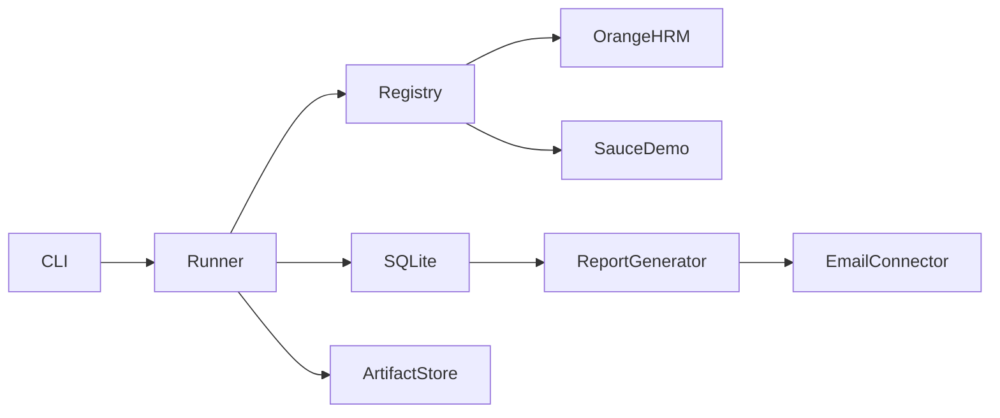

# Design

## Executive summary

This project implements a small production-oriented portal automation platform, not two isolated Playwright scripts.

The implementation is intentionally scoped for the Zentist RPA Lead test task while demonstrating how the same structure could grow to many external portals, recurring jobs, per-item persistence, reporting, failure isolation, and operational support.

### Figure ZQ9

## Job lifecycle

The job lifecycle will be implemented through BasePortalRunnerZX and portal-specific runners.

## Idempotency and recovery

Per-item results will be persisted with a business-date based idempotency key and SQLite upsert behavior.

## Operational model

The design favors visible outcomes, structured logs, dry-run support, isolated portal workflows, and clear failure reasons.
