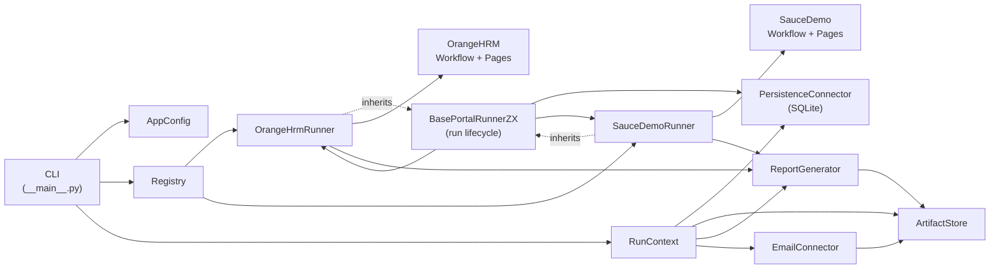

# Design

## Executive Summary

This project implements a production-oriented portal automation platform for the Zentist RPA
Lead take-home assignment. It is not two isolated browser scripts. The code separates shared
execution lifecycle, persistence, reporting, artifacts, retries, configuration, and portal
registry from portal-specific workflows and page objects.

The current implementation supports two registered portals:

- `orangehrm`
- `saucedemo`

### Figure ZQ9



Key relationships:

- CLI reads `AppConfig`, queries the registry, and assembles `RunContext`.
- Registry maps portal names to runner classes; runners do not query the registry.
- `OrangeHrmRunner` and `SauceDemoRunner` inherit from `BasePortalRunnerZX`.
- Portal runners do not override `run()`.
- `BasePortalRunnerZX.run()` owns the lifecycle and calls `PersistenceConnector` directly.
- The base lifecycle calls portal hooks; `process_item()` delegates to workflow and page
  objects.
- `ReportGenerator` and `EmailConnector` both write through `ArtifactStore`.
- `EmailConnector` is wired in the CLI context, but current portal runner finalizers only call
  `write_report()`, not `send_report()`.

## Orchestration And Throughput

The CLI selects one portal or `all`. The current execution model is sequential across selected
portals and sequential within each portal's item list. This keeps behavior deterministic for
the take-home assignment and makes persistence, reporting, and recovery straightforward to
review.

Per-item failures are isolated. A failed item is converted into an `ItemResult`, persisted, and
the batch continues. The final run status is:

- `success` when all final item outcomes are successful or no items were processed in dry-run;
- `partial_success` when there is a mix of successful and failed outcomes;
- `failed` when all processed outcomes failed.

Future concurrency would need to respect portal-specific constraints, especially single-login
or single-account session boundaries.

## Portal Constraints

OrangeHRM:

- Registry key: `orangehrm`.
- Runner class: `OrangeHrmRunner`.
- Operation: `sync_employee_state`.
- Item key: `employee_key`.
- Session constraint: `max_sessions_per_login = 1`.
- Real runs require `ORANGEHRM_PASSWORD`.
- The workflow finds or creates an employee, updates job fields, generates a salary document,
  uploads it when needed, and verifies attachment presence.

Sauce Demo:

- Registry key: `saucedemo`.
- Runner class: `SauceDemoRunner`.
- Operation: `checkout`.
- Item key: `account_key`.
- Session constraint: `max_sessions_per_account = 1`.
- Real runs require `SAUCEDEMO_PASSWORD`.
- Password-like values are rejected from input data.
- The workflow logs in, adds inventory items, validates cart and summary counts, completes
  checkout, and filters secret-like captured detail keys.

The default CLI does not wire a live browser/page factory into either runner. Dry-run is the
safe CLI smoke path. Page objects and workflows are covered with fake-page tests.

## Isolation And Failure Handling

Known portal failures are raised as `PortalError` with a `ReasonCode`. The base lifecycle
converts those into failed `ItemResult` rows. Unexpected item exceptions become
`ReasonCode.UNEXPECTED_ERROR`.

Persistence writes are intentionally close to item processing:

1. `mark_item_in_progress()` records the item before `process_item()`.
2. `process_item()` returns a final `ItemResult` or raises an item-level error.
3. `upsert_item_result()` commits the final outcome.

If a persistence write fails, the logger is called on a best-effort basis and the exception is
raised. The run is not silently treated as successful.

`RetryPolicy` is available for retryable portal operations. Its retryable reason codes are
`PORTAL_TIMEOUT`, `PORTAL_UNAVAILABLE`, and `SESSION_DROPPED`. Non-retryable examples include
`LOCKED_OUT`, `INPUT_VALIDATION_FAILED`, `EMPLOYEE_MATCH_AMBIGUOUS`, and
`CREDENTIAL_EXPIRED`. The base lifecycle does not auto-retry, and the current portal
workflows do not invoke `RetryPolicy` directly. `PortalError.attempts` records how many
attempts were made by retry-aware code.

## Idempotency And Recovery

The architectural idempotency key is:

```text
business_date + portal_name + item_key + operation
```

The SQLite schema enforces it with:

```text
UNIQUE (business_date, portal_name, item_key, operation)
```

`get_committed_items()` returns same-day successful item keys for a portal. The base lifecycle
skips those items on rerun. `list_results_by_business_date()` lets reports include persisted
same-day results, including successful items from earlier runs.

Crash and silent failure recovery surfaces are:

- `find_stale_items()`
- `find_stale_runs()`
- `mark_run_stale()`

These methods are available for external monitoring scripts. `BasePortalRunnerZX.run()` does
not call them automatically.

## Monitoring And Observability

Current observable surfaces are:

- SQLite `runs` rows;
- SQLite `item_results` rows;
- structured `ReasonCode` values;
- generated `report.txt` files;
- run artifacts under `ARTIFACTS_DIR/runs/<run_id>/`;
- stale item and run queries;
- unit and integration test coverage.

The CLI currently uses `_NoOpLogger` and `_NoOpMetrics`. They keep the runtime context shape
stable without claiming full production telemetry.

## Technology Choices

Python package + CLI:

- simple to install and review;
- deterministic in local execution;
- keeps the take-home scope focused on lifecycle, persistence, and tests.

SQLite:

- durable local state without external services;
- supports idempotency and recovery checks;
- easy for reviewers to inspect.

pytest + ruff:

- fast verification;
- default unit and integration coverage without live portal dependencies;
- style and import checks aligned with the project constraints.

Rejected options:

- n8n: useful for low-code orchestration, but the assignment needs code-level lifecycle,
  tests, idempotency, and recovery semantics.
- UiPath: heavier runtime and less transparent for source-controlled review.
- Airflow: scheduler infrastructure is outside this slice and would obscure the core portal
  execution model.

## Operating Model

Credentials rotate through environment variables. Input files contain business data, not
passwords. Run dry-run first to validate CLI wiring, input loading, DB creation, and report
artifacts.

When a portal is down or layout behavior changes, failures should surface through
`ReasonCode`, persisted item rows, and generated reports. If a process dies mid-run, stale
`in_progress` items and unfinished runs can be found through the persistence recovery methods.

The SQLite DB and artifacts should be retained for audit and recovery. This repository does
not include a web UI, HTTP API, scheduler, production deployment packaging, installed
Playwright runtime, or implemented SMTP delivery.
